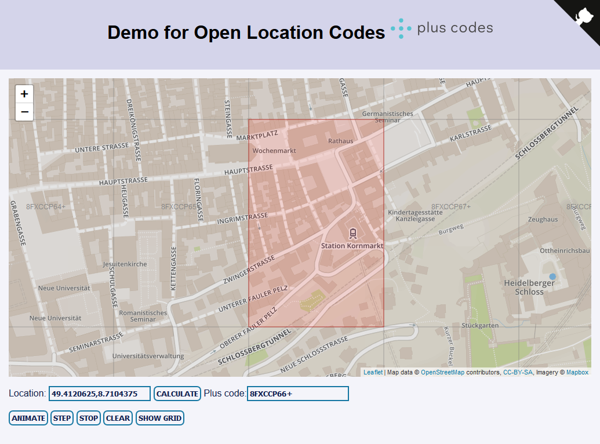

Demo for Open Location Codes / plus codes
=========================================

This is a visual demonstration of the structure of Google Plus+Codes or Open Location Codes.

Take a look at the demo on Github pages at [cvzi.github.io/open-location-code-demo/](https://cvzi.github.io/open-location-code-demo/index.html)

Wikipedia: <a href="https://en.wikipedia.org/wiki/Open_Location_Code">Open Location Code</a>

Screenshot:

